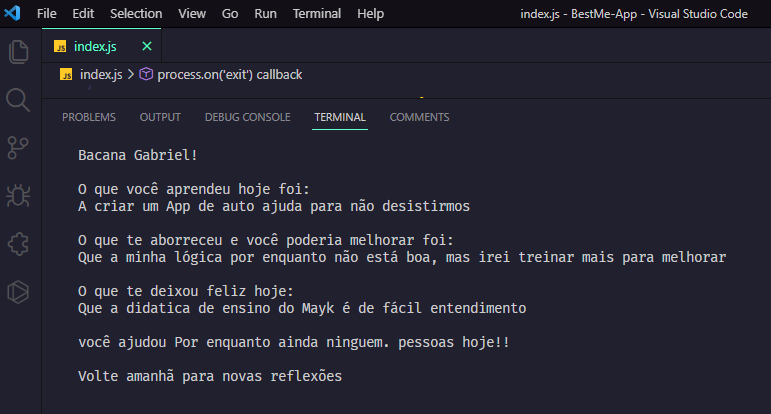

<h1 align="center">
  BestMe APP
</h1>

  

 

## 🚀 Tecnologias

- JavaScript

# Encontre sua melhor versão

#### 🤔 Use o App ao final de cada dia e, tire suas proprias reflexões, sobre a sua jornada de DEV
 

# Como Rodar: 
<h2>node index.js</h2>